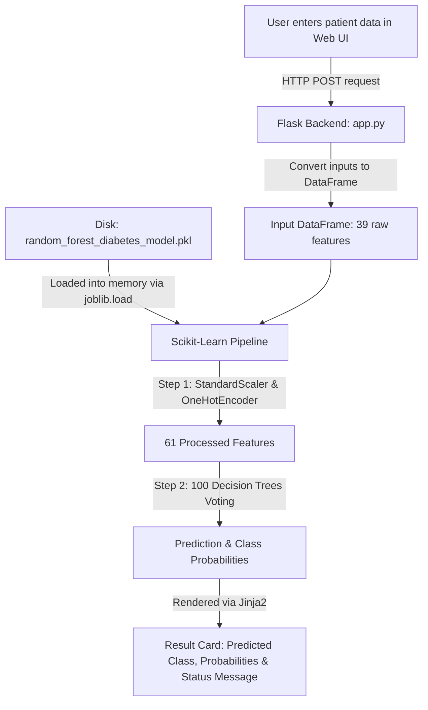

# Machine Learning Classification Lab — Diabetes Dataset

## 1. Lab Objective

The objective of this laboratory exercise is to build, evaluate, and understand an end-to-end Machine Learning classification workflow using a structured tabular dataset.

In machine learning, **classification** is a supervised learning task where the model learns patterns from historical data (features) to predict which category or class a new observation belongs to (e.g., whether a patient has diabetes or not).

The primary milestones for this lab include:
1. **Inspecting and understanding the data** to verify lab requirements (at least 100,000 records, 35 features, and a valid classification target).
2. **Preparing the dataset** (cleaning, handling encoding, and addressing feature requirements).
3. **Partitioning the data** using a strict **60% training / 40% testing split** to train the model on one subset and objectively test its generalization ability on unseen data.
4. **Training a classification model** to predict the target label.
5. **Evaluating the model** using industry-standard classification metrics:
   * **Accuracy**: The overall percentage of correct predictions.
   * **Precision**: How many of the predicted positive cases were actually positive (minimizing false alarms).
   * **Recall (Sensitivity)**: How many of the actual positive cases were correctly captured by the model (critical in healthcare to avoid missing sick patients).
   * **Confusion Matrix**: A detailed 2x2 grid showing True Positives, True Negatives, False Positives, and False Negatives.

---

## 2. Dataset Information

* **Dataset Filename:** `diabetes.csv` (located in the project workspace)
* **Number of Records (Rows):** 100,000
* **Number of Columns:** 31
* **Current Target Candidate:** `diagnosed_diabetes`
* **Classification Type:** Binary Classification (Classes: `0` = No Diabetes, `1` = Diabetes Diagnosed)
* **Missing Values:** 0
* **Duplicate Rows:** 0
* **100K Records Requirement:** **PASS** (100,000 rows present)
* **35-Column Requirement:** **FAIL** (31 columns present; 4 short of 35)

> **Official Status Note:**  
> At the inspection stage, the dataset contains 100,000 records and 31 columns. Therefore, it satisfies the 100,000-record requirement but does not currently satisfy the 35-column requirement.

---

## 3. Step 1 — Dataset Inspection

### Objective

Before applying any transformations, modifications, or machine learning algorithms, a data scientist must always perform an exploratory inspection. 

Inspecting the raw data allows us to:
* Verify if the dataset satisfies the instructor's structural constraints (row and column counts).
* Confirm data integrity (check for corrupt data, unexpected data types, or missing values).
* Check whether rows are duplicated, which could artificially bias model evaluation.
* Identify which features are continuous numbers vs. categories so appropriate preprocessing can be planned.
* Select the correct target label based on domain logic rather than assumptions.

### What Was Done

We loaded `diabetes.csv` into a Python environment using the `pandas` data analysis library (`pd.read_csv('diabetes.csv')`) and ran non-destructive inspection functions:
* `df.shape`: Checked the total matrix dimensions (rows and columns).
* `df.columns` & `df.dtypes`: Examined every column name and how pandas stored each feature in memory (`int64`, `float64`, or `object`).
* `df.isnull().sum()`: Counted empty/null entries across every column.
* `df.duplicated().sum()`: Checked for identical duplicate rows across all features.
* `df.nunique()` & `df.value_counts()`: Inspected unique category values for text features and identified low-cardinality numeric columns.
* Distribution analysis on candidate targets (`diagnosed_diabetes` and `diabetes_stage`).

### Results

#### Column-by-Column Inventory

| # | Column Name | Data Type | Feature Nature | Missing Values | Unique Values |
|---|---|---|---|---|---|
| 1 | `age` | `int64` | Numerical (Age in years: 18 to 90) | 0 | 73 |
| 2 | `gender` | `object` | Categorical (Female, Male, Other) | 0 | 3 |
| 3 | `ethnicity` | `object` | Categorical (White, Hispanic, Black, Asian, Other) | 0 | 5 |
| 4 | `education_level` | `object` | Categorical (Highschool, Graduate, Postgraduate, No formal) | 0 | 4 |
| 5 | `income_level` | `object` | Categorical (Middle, Lower-Middle, Upper-Middle, Low, High) | 0 | 5 |
| 6 | `employment_status` | `object` | Categorical (Employed, Retired, Unemployed, Student) | 0 | 4 |
| 7 | `smoking_status` | `object` | Categorical (Never, Current, Former) | 0 | 3 |
| 8 | `alcohol_consumption_per_week` | `int64` | Numerical (Units per week: 0 to 10) | 0 | 11 |
| 9 | `physical_activity_minutes_per_week` | `int64` | Numerical (Minutes per week: 0 to 833) | 0 | 620 |
| 10 | `diet_score` | `float64` | Numerical (Score: 0.0 to 10.0) | 0 | 101 |
| 11 | `sleep_hours_per_day` | `float64` | Numerical (Hours: 3.0 to 10.0) | 0 | 71 |
| 12 | `screen_time_hours_per_day` | `float64` | Numerical (Hours: 0.5 to 16.8) | 0 | 156 |
| 13 | `family_history_diabetes` | `int64` | Categorical Binary Flag (`0` = No, `1` = Yes) | 0 | 2 |
| 14 | `hypertension_history` | `int64` | Categorical Binary Flag (`0` = No, `1` = Yes) | 0 | 2 |
| 15 | `cardiovascular_history` | `int64` | Categorical Binary Flag (`0` = No, `1` = Yes) | 0 | 2 |
| 16 | `bmi` | `float64` | Numerical (Body Mass Index: 15.0 to 39.2) | 0 | 240 |
| 17 | `waist_to_hip_ratio` | `float64` | Numerical (Ratio: 0.67 to 1.06) | 0 | 40 |
| 18 | `systolic_bp` | `int64` | Numerical (Blood pressure mmHg: 90 to 179) | 0 | 86 |
| 19 | `diastolic_bp` | `int64` | Numerical (Blood pressure mmHg: 50 to 110) | 0 | 60 |
| 20 | `heart_rate` | `int64` | Numerical (Beats per minute: 40 to 105) | 0 | 64 |
| 21 | `cholesterol_total` | `int64` | Numerical (mg/dL: 100 to 318) | 0 | 210 |
| 22 | `hdl_cholesterol` | `int64` | Numerical (mg/dL: 20 to 98) | 0 | 79 |
| 23 | `ldl_cholesterol` | `int64` | Numerical (mg/dL: 50 to 263) | 0 | 190 |
| 24 | `triglycerides` | `int64` | Numerical (mg/dL: 30 to 344) | 0 | 262 |
| 25 | `glucose_fasting` | `int64` | Numerical (mg/dL: 60 to 172) | 0 | 109 |
| 26 | `glucose_postprandial` | `int64` | Numerical (mg/dL: 70 to 287) | 0 | 210 |
| 27 | `insulin_level` | `float64` | Numerical (mu U/mL: 2.0 to 32.22) | 0 | 2350 |
| 28 | `hba1c` | `float64` | Numerical (%: 4.0 to 9.8) | 0 | 548 |
| 29 | `diabetes_risk_score` | `float64` | Numerical (Risk index: 2.7 to 67.2) | 0 | 569 |
| 30 | `diabetes_stage` | `object` | Categorical Multiclass (5 stages) | 0 | 5 |
| 31 | `diagnosed_diabetes` | `int64` | Categorical Binary Target (`0` or `1`) | 0 | 2 |

#### Categorical Features Details

* **`gender`** (3 categories): Female (50,216), Male (47,771), Other (2,013)
* **`ethnicity`** (5 categories): White (44,997), Hispanic (20,103), Black (17,986), Asian (11,865), Other (5,049)
* **`education_level`** (4 categories): Highschool (44,891), Graduate (35,037), Postgraduate (14,972), No formal (5,100)
* **`income_level`** (5 categories): Middle (35,152), Lower-Middle (25,150), Upper-Middle (19,866), Low (14,830), High (5,002)
* **`employment_status`** (4 categories): Employed (60,175), Retired (21,761), Unemployed (11,918), Student (6,146)
* **`smoking_status`** (3 categories): Never (59,813), Current (20,176), Former (20,011)
* **`diabetes_stage`** (5 categories): Type 2 (59,774), Pre-Diabetes (31,845), No Diabetes (7,981), Gestational (278), Type 1 (122)

#### Numeric Features Representing Binary Categories
* `family_history_diabetes`: `0` = No (78,059), `1` = Yes (21,941)
* `hypertension_history`: `0` = No (74,920), `1` = Yes (25,080)
* `cardiovascular_history`: `0` = No (92,080), `1` = Yes (7,920)
* `diagnosed_diabetes`: `0` = Negative (40,002), `1` = Positive (59,998)

### Important Observation

1. **Column Requirement Gap:** The dataset contains **31 columns**, which is 4 columns short of the instructor's requirement of **at least 35 columns**.
2. **Missing Values & Duplicates:** The dataset is clean of missing entries (0 null values) and has no duplicate rows (0 duplicates across all 100,000 records).
3. **Target Selection:** 
   * `diagnosed_diabetes` is currently the proposed classification target because it contains clean binary values (`0` and `1`), which fits the required binary metrics (Accuracy, Precision, Recall, Confusion Matrix).
   * `diabetes_stage` is another possible target with 5 classes, but for our lab we are currently considering `diagnosed_diabetes` as the target.
4. **Dataset Preservation:** We have **NOT** cleaned, modified, removed, encoded, or trained anything yet. The original dataset `diabetes.csv` is completely preserved in its original state.

---

## 4. Step 2 — Numerical Data Validation

### Objective

The objective of this step is to systematically inspect all numerical variables in `diabetes.csv` to ensure that data values are physiologically plausible, statistically sound, and free from hidden corruptions (such as negative ages, placeholder numbers like `-999` or `0` for blood pressure, or impossible physiological readings). 

In clinical machine learning, validating numbers before training is crucial: garbage data entering a model produces biased or unreliable predictions (the *Garbage In, Garbage Out* principle).

### What Was Checked

* **Range & Boundary Feasibility:** Verified minimum, maximum, mean, median, and standard deviation for every numerical variable.
* **Impossible / Invalid Values:** Checked for negative readings, artificial zero-placeholders in critical vital signs, and extreme anomalies outside the bounds of human biology.
* **Statistical Outliers:** Calculated Interquartile Ranges (IQR) to detect statistical distribution extremes across all clinical continuous and discrete features.
* **Integrity of Binary Indicator Columns:** Verified that indicator columns stored numerically only hold discrete boolean states (`0` and `1`).

### Methods Used

1. **Descriptive Statistics:** `df.describe()` and custom aggregations calculating Min, Max, Mean, Median, and Standard Deviation (Std).
2. **Interquartile Range (IQR) Rule for Outlier Detection:**
   * First Quartile ($Q_1$ = 25th percentile) and Third Quartile ($Q_3$ = 75th percentile).
   * Interquartile Range: $\text{IQR} = Q_3 - Q_1$.
   * Lower Bound = $Q_1 - 1.5 \times \text{IQR}$.
   * Upper Bound = $Q_3 + 1.5 \times \text{IQR}$.
   * Any data point $x < \text{Lower Bound}$ or $x > \text{Upper Bound}$ was flagged as a potential statistical outlier.
3. **Zero and Negative Value Auditing:** Evaluated explicit counts of zero and negative entries per column.

### Numerical Columns Inspected

Out of 31 total columns, **24 columns are numeric** (`int64` and `float64`):
* **20 Continuous / Discrete Features:** `age`, `alcohol_consumption_per_week`, `physical_activity_minutes_per_week`, `diet_score`, `sleep_hours_per_day`, `screen_time_hours_per_day`, `bmi`, `waist_to_hip_ratio`, `systolic_bp`, `diastolic_bp`, `heart_rate`, `cholesterol_total`, `hdl_cholesterol`, `ldl_cholesterol`, `triglycerides`, `glucose_fasting`, `glucose_postprandial`, `insulin_level`, `hba1c`, `diabetes_risk_score`.
* **4 Binary Indicators (Stored as `int64`):** `family_history_diabetes`, `hypertension_history`, `cardiovascular_history`, and `diagnosed_diabetes`.

*(The 7 object/text columns `gender`, `ethnicity`, `education_level`, `income_level`, `employment_status`, `smoking_status`, and `diabetes_stage` were excluded from this numerical analysis).*

### Important Statistics

| Column Name | Min | Max | Mean | Median | Std Dev |
|---|---|---|---|---|---|
| `age` | 18.00 | 90.00 | 50.12 | 50.00 | 15.60 |
| `alcohol_consumption_per_week` | 0.00 | 10.00 | 2.00 | 2.00 | 1.42 |
| `physical_activity_minutes_per_week` | 0.00 | 833.00 | 118.91 | 100.00 | 84.41 |
| `diet_score` | 0.00 | 10.00 | 5.99 | 6.00 | 1.78 |
| `sleep_hours_per_day` | 3.00 | 10.00 | 7.00 | 7.00 | 1.09 |
| `screen_time_hours_per_day` | 0.50 | 16.80 | 6.00 | 6.00 | 2.47 |
| `bmi` | 15.00 | 39.20 | 25.61 | 25.60 | 3.59 |
| `waist_to_hip_ratio` | 0.67 | 1.06 | 0.86 | 0.86 | 0.05 |
| `systolic_bp` | 90.00 | 179.00 | 115.80 | 116.00 | 14.28 |
| `diastolic_bp` | 50.00 | 110.00 | 75.23 | 75.00 | 8.20 |
| `heart_rate` | 40.00 | 105.00 | 69.63 | 70.00 | 8.37 |
| `cholesterol_total` | 100.00 | 318.00 | 185.98 | 186.00 | 32.01 |
| `hdl_cholesterol` | 20.00 | 98.00 | 54.04 | 54.00 | 10.27 |
| `ldl_cholesterol` | 50.00 | 263.00 | 103.00 | 102.00 | 33.39 |
| `triglycerides` | 30.00 | 344.00 | 121.46 | 121.00 | 43.37 |
| `glucose_fasting` | 60.00 | 172.00 | 111.12 | 111.00 | 13.60 |
| `glucose_postprandial` | 70.00 | 287.00 | 160.04 | 160.00 | 30.94 |
| `insulin_level` | 2.00 | 32.22 | 9.06 | 8.79 | 4.95 |
| `hba1c` | 4.00 | 9.80 | 6.52 | 6.52 | 0.81 |
| `diabetes_risk_score` | 2.70 | 67.20 | 30.22 | 29.00 | 9.06 |
| `family_history_diabetes` (Binary) | 0.00 | 1.00 | 0.22 | 0.00 | 0.41 |
| `hypertension_history` (Binary) | 0.00 | 1.00 | 0.25 | 0.00 | 0.43 |
| `cardiovascular_history` (Binary) | 0.00 | 1.00 | 0.08 | 0.00 | 0.27 |
| `diagnosed_diabetes` (Binary Target)| 0.00 | 1.00 | 0.60 | 1.00 | 0.49 |

### Suspicious / Invalid Values Found

1. **Definitely Impossible / Invalid Values (0 Found):**
   * **Negative values:** None. Every column has a minimum $\ge 0$.
   * **False zero placeholders:** Unlike some clinical datasets where missing blood pressure, glucose, or BMI are erroneously encoded as `0`, here all vital clinical metrics (`bmi`, `systolic_bp`, `glucose_fasting`, `hba1c`, etc.) have strictly non-zero, physiologically positive values.
   * **Out-of-bounds metrics:** No human ages below 18 or above 90, no negative sleep or screen times, and bounded scores (`diet_score` strictly 0.0 to 10.0).
2. **Unusual but Clinically Plausible Values:**
   * High physical activity (max 833 mins/week $\approx$ 13.8 hrs/week, or ~2 hrs/day) represents active fitness individuals.
   * High systolic blood pressure (up to 179 mmHg) represents severe Stage 2 hypertension.
   * Elevated HbA1c (up to 9.8%) and postprandial glucose (up to 287 mg/dL) represent patients with uncontrolled Type 2 diabetes.
3. **Normal Range Values:**
   * The vast majority (>97%) of all measurements fall comfortably within standard human physiological distributions.

### Potential Outliers Found (1.5 × IQR Method)

| Column Name | Q1 (25%) | Q3 (75%) | IQR | Lower Bound | Upper Bound | Outlier Count | % of Dataset | Outlier Min | Outlier Max |
|---|---|---|---|---|---|---|---|---|---|
| `age` | 39.00 | 61.00 | 22.00 | 6.00 | 94.00 | 0 | 0.00% | — | — |
| `alcohol_consumption_per_week` | 1.00 | 3.00 | 2.00 | -2.00 | 6.00 | 458 | 0.46% | 7.00 | 10.00 |
| `physical_activity_minutes_per_week` | 57.00 | 160.00 | 103.00 | -97.50 | 314.50 | 3,199 | 3.20% | 315.00 | 833.00 |
| `diet_score` | 4.80 | 7.20 | 2.40 | 1.20 | 10.80 | 337 | 0.34% | 0.00 | 1.10 |
| `sleep_hours_per_day` | 6.30 | 7.70 | 1.40 | 4.20 | 9.80 | 900 | 0.90% | 3.00 | 10.00 |
| `screen_time_hours_per_day` | 4.30 | 7.70 | 3.40 | -0.80 | 12.80 | 305 | 0.30% | 12.90 | 16.80 |
| `bmi` | 23.20 | 28.00 | 4.80 | 16.00 | 35.20 | 744 | 0.74% | 15.00 | 39.20 |
| `waist_to_hip_ratio` | 0.82 | 0.89 | 0.07 | 0.71 | 1.00 | 273 | 0.27% | 0.67 | 1.06 |
| `systolic_bp` | 106.00 | 125.00 | 19.00 | 77.50 | 153.50 | 530 | 0.53% | 154.00 | 179.00 |
| `diastolic_bp` | 70.00 | 81.00 | 11.00 | 53.50 | 97.50 | 731 | 0.73% | 50.00 | 110.00 |
| `heart_rate` | 64.00 | 75.00 | 11.00 | 47.50 | 91.50 | 855 | 0.85% | 40.00 | 105.00 |
| `cholesterol_total` | 164.00 | 208.00 | 44.00 | 98.00 | 274.00 | 309 | 0.31% | 275.00 | 318.00 |
| `hdl_cholesterol` | 47.00 | 61.00 | 14.00 | 26.00 | 82.00 | 565 | 0.56% | 20.00 | 98.00 |
| `ldl_cholesterol` | 78.00 | 126.00 | 48.00 | 6.00 | 198.00 | 349 | 0.35% | 199.00 | 263.00 |
| `triglycerides` | 91.00 | 151.00 | 60.00 | 1.00 | 241.00 | 301 | 0.30% | 242.00 | 344.00 |
| `glucose_fasting` | 102.00 | 120.00 | 18.00 | 75.00 | 147.00 | 745 | 0.74% | 60.00 | 172.00 |
| `glucose_postprandial` | 139.00 | 181.00 | 42.00 | 76.00 | 244.00 | 634 | 0.63% | 70.00 | 287.00 |
| `insulin_level` | 5.09 | 12.45 | 7.36 | -5.95 | 23.49 | 326 | 0.33% | 23.50 | 32.22 |
| `hba1c` | 5.97 | 7.07 | 1.10 | 4.32 | 8.72 | 618 | 0.62% | 4.00 | 9.80 |
| `diabetes_risk_score` | 23.80 | 35.60 | 11.80 | 6.10 | 53.30 | 914 | 0.91% | 2.70 | 67.20 |

### Interpretation of Results

1. **Very Low Outlier Frequency:** Potential outliers comprise under 1% of rows in nearly all features (only physical activity exceeds 1% at 3.20%).
2. **Clinical Authenticity:** In medical machine learning, an "outlier" is frequently **not an error**, but a hallmark of the pathology being studied. Diabetic patients naturally present with elevated HbA1c, high blood sugar, elevated triglycerides, and higher BMI. Removing these points would strip away the most informative signals needed to classify diabetic patients accurately.
3. **Conclusion:** All numerical values are realistic, bounded within human biological limits, and represent genuine clinical variation rather than sensor failure or typographical error.

### Dataset Modification Status

> **Confirmation:**  
> **No data was modified during this step.** The original `diabetes.csv` file remains 100% untouched.

---

---

## 5. Step 3 — Feature/Target Separation and 60/40 Train-Test Split

### Objective

In supervised machine learning, we must separate the data into:
1. **Independent Features ($X$):** The input observations, measurements, and patient characteristics used to make predictions.
2. **Dependent Target ($y$):** The true outcome label we want the model to learn to predict (`diagnosed_diabetes`).

Furthermore, we must partition the data into a **Training Set** (60%) and a **Testing Set** (40%) *before* any feature engineering, encoding, scaling, or modeling takes place.

### Why a 60/40 Train-Test Split?

* **Preventing Overfitting & Cheating:** If a model is evaluated on the exact same data it learned from, it can simply memorize the answers (overfitting). A test set acts as an honest exam containing completely unseen cases.
* **Lab Requirement:** The instructor specified a 60% training / 40% testing split (60,000 training records, 40,000 testing records).
* **Statistical Power:** With 100,000 total rows, a 40% test set provides 40,000 unseen samples, giving very high statistical confidence and narrow confidence intervals when measuring Accuracy, Precision, Recall, and the Confusion Matrix.

### Why Use `stratify=y` and a Fixed `random_state`?

* **Stratification (`stratify=y`):** When randomly splitting data, there is a risk that one class might be underrepresented or overrepresented in the train or test set. Stratified sampling guarantees that both the training set and the test set preserve the exact original proportion of positive (`1`) and negative (`0`) cases (~60.0% diagnosed, ~40.0% not diagnosed).
* **Reproducibility (`random_state=42`):** Machine learning experiments must be reproducible. Setting a fixed random seed ensures that anyone re-running the script will get the exact same split down to the individual patient record.

### What Was Done

1. Loaded original `diabetes.csv`.
2. Defined target vector $y$:
   ```python
   y = df['diagnosed_diabetes']
   ```
3. Defined initial feature matrix $X$ with all remaining 30 columns:
   ```python
   X = df.drop(columns=['diagnosed_diabetes'])
   ```
4. Identified all categorical (text/object) columns present in $X$.
5. Performed deep investigation into `diabetes_stage` and evaluated target leakage risk.
6. Executed stratified 60/40 partition:
   ```python
   X_train, X_test, y_train, y_test = train_test_split(
       X, y, test_size=0.40, random_state=42, stratify=y
   )
   ```
7. Audited shapes and class distributions across all subsets.

### Resulting Matrix Shapes

| Dataset / Subset | Rows | Columns | Description |
|---|---|---|---|
| **$X$ (Full Features)** | 100,000 | 30 | All potential input features |
| **$y$ (Full Target)** | 100,000 | 1 | Target label (`diagnosed_diabetes`) |
| **$X_{\text{train}}$** | 60,000 | 30 | 60% feature records for model training |
| **$X_{\text{test}}$** | 40,000 | 30 | 40% unseen feature records for evaluation |
| **$y_{\text{train}}$** | 60,000 | 1 | 60% target labels for model training |
| **$y_{\text{test}}$** | 40,000 | 1 | 40% ground-truth target labels for evaluation |

### Class Distributions and Stratification Verification

| Split | Class 0 (No Diabetes) | Class 1 (Diagnosed Diabetes) | Total Rows | % Class 1 |
|---|---|---|---|---|
| **Full Dataset ($y$)** | 40,002 | 59,998 | 100,000 | 59.998% |
| **Training Set ($y_{\text{train}}$)** | 24,001 | 35,999 | 60,000 | 59.998% |
| **Testing Set ($y_{\text{test}}$)** | 16,001 | 23,999 | 40,000 | 59.998% |

* **Verification Checks:**
  1. `diagnosed_diabetes` present in $X$: **False** (cleanly isolated).
  2. Training rows (60,000) + Testing rows (40,000) = **100,000** (100% row preservation).
  3. Class balance: Exactly identical across all subsets (59.998% Class 1, 40.002% Class 0).

### Categorical Columns Identified in $X$

There are **7 columns** in $X$ stored as text objects (`object` dtype):
1. `gender` (3 categories: Female, Male, Other)
2. `ethnicity` (5 categories: White, Hispanic, Black, Asian, Other)
3. `education_level` (4 categories: Highschool, Graduate, Postgraduate, No formal)
4. `income_level` (5 categories: Middle, Lower-Middle, Upper-Middle, Low, High)
5. `employment_status` (4 categories: Employed, Retired, Unemployed, Student)
6. `smoking_status` (3 categories: Never, Current, Former)
7. `diabetes_stage` (5 categories: Type 2, Pre-Diabetes, No Diabetes, Gestational, Type 1)

*(Note: In addition, 3 integer columns act as binary flags: `family_history_diabetes`, `hypertension_history`, `cardiovascular_history`).*

### Critical Finding: Target Leakage Concern for `diabetes_stage`

#### What is Target Leakage?
**Target leakage (or data leakage)** occurs when an input feature provided to a machine learning model contains direct information about the target outcome that would *not* realistically be available at the time of prediction.

#### Investigation of `diabetes_stage`:
A cross-tabulation of `diabetes_stage` against the target `diagnosed_diabetes` reveals an almost deterministic overlap:

| `diabetes_stage` | `diagnosed_diabetes = 0` | `diagnosed_diabetes = 1` | Total | % Diagnosed |
|---|---|---|---|---|
| **Type 2** | 0 | 59,774 | 59,774 | **100.0%** |
| **Pre-Diabetes** | 31,845 | 0 | 31,845 | **0.0%** |
| **No Diabetes** | 7,981 | 0 | 7,981 | **0.0%** |
| **Gestational** | 120 | 158 | 278 | 56.8% |
| **Type 1** | 56 | 66 | 122 | 54.1% |
| **Total** | 40,002 | 59,998 | 100,000 | 60.0% |

#### Clinical and Practical Implication:
1. If a patient is categorized as having `Type 2` diabetes stage, they are diagnosed with diabetes 100% of the time. If they are categorized as `No Diabetes` or `Pre-Diabetes`, they are non-diagnosed 100% of the time.
2. In a real clinical screening context, determining the **stage** of diabetes is an outcome of medical diagnosis, not an initial symptom or biomarker.
3. If `diabetes_stage` is retained as an input feature in $X$, the machine learning model will simply learn a trivial rule: *"If stage == Type 2, predict 1, else predict 0"*. It will ignore critical physiological signals (like fasting glucose, HbA1c, insulin, BMI). While test accuracy might appear near 100%, the model would be clinically invalid and fail completely on unscreened, undiagnosed patients.

#### Recommendation:
**We strongly recommend excluding `diabetes_stage` from the input feature set $X$ before model training.**

### Status of Encoding and Model Training

> **Confirmation:**  
> * **No categorical columns have been encoded yet.**  
> * **No numerical columns have been scaled yet.**  
> * **No outliers or rows were removed.**  
> * **No machine learning model has been trained.**  
> * **Original `diabetes.csv` is completely preserved.**

---

## 6. Step 4 — Categorical Encoding and Numerical Scaling

### Objective

The objective of this step is to transform the raw, heterogeneous feature matrices ($X_{\text{train}}$ and $X_{\text{test}}$) into an entirely numeric, standardized format ready for machine learning algorithms, while preventing any form of data leakage or target leakage.

### What Was Done

1. **Created Preprocessing Script:** Authored [`step4_preprocessing.py`](file:///c:/Users/231969/Downloads/archive/step4_preprocessing.py) implementing a modular `ColumnTransformer` pipeline.
2. **Excluded Target and Leaking Columns:** 
   * Excluded `diagnosed_diabetes` (ground-truth target $y$).
   * Excluded `diabetes_stage` (identified as severe target leakage).
3. **Partitioned Data:** Executed a stratified 60/40 train-test split on $X$ and $y$ using `random_state=42`.
4. **Built Transformer Pipelines:**
   * Numerical transformer: `StandardScaler()` applied to all 23 numeric features.
   * Categorical transformer: `OneHotEncoder(handle_unknown='ignore', sparse_output=False)` applied to all 6 categorical features.
5. **Strict Leak-Free Fitting:** 
   * Fitted the preprocessor strictly on $X_{\text{train}}$ using `.fit_transform()`.
   * Transformed $X_{\text{test}}$ using `.transform()`, applying the scaling means, standard deviations, and category encodings learned strictly from the training partition.
6. **Executed Script:** Ran `python step4_preprocessing.py` in the Anaconda environment and verified all output dimensions and assertions.

### Numerical Columns (23 Columns)

`['age', 'alcohol_consumption_per_week', 'physical_activity_minutes_per_week', 'diet_score', 'sleep_hours_per_day', 'screen_time_hours_per_day', 'family_history_diabetes', 'hypertension_history', 'cardiovascular_history', 'bmi', 'waist_to_hip_ratio', 'systolic_bp', 'diastolic_bp', 'heart_rate', 'cholesterol_total', 'hdl_cholesterol', 'ldl_cholesterol', 'triglycerides', 'glucose_fasting', 'glucose_postprandial', 'insulin_level', 'hba1c', 'diabetes_risk_score']`

### Categorical Columns (6 Columns)

`['gender', 'ethnicity', 'education_level', 'income_level', 'employment_status', 'smoking_status']`

### Key Machine Learning Concepts (Viva Preparation)

#### 1. Why Categorical Data Needs Encoding
Machine learning algorithms (such as Logistic Regression, Support Vector Machines, and Neural Networks) compute dot products, gradients, and geometric distances. They cannot perform mathematical operations on text strings (e.g., `"Female"`, `"Highschool"`, `"Employed"`). Encoding converts these qualitative symbols into quantitative vectors.

#### 2. Why One-Hot Encoding (OHE) Was Used
* If we simply assigned arbitrary numbers (e.g., White=1, Hispanic=2, Black=3), models would falsely assume an ordered magnitude ($3 > 2 > 1$) or compute meaningless distances between categories.
* **One-Hot Encoding** creates an independent binary column ($0$ or $1$) for each unique category level. 
* We used `handle_unknown='ignore'` so that if an unprecedented category ever appears in unseen testing data, the pipeline assigns zeros across all one-hot columns rather than throwing an exception.

#### 3. Why StandardScaler Was Used
* Features in this dataset have radically different units and variances:
  * `waist_to_hip_ratio` varies between $0.67$ and $1.06$.
  * `glucose_postprandial` varies between $70$ and $287$.
  * `physical_activity_minutes_per_week` reaches up to $833$.
* Without scaling, algorithms that optimize weights or calculate distances would be overwhelmingly dominated by high-magnitude numbers (like glucose and physical activity) while neglecting subtle but critical ratios.
* **StandardScaler** transforms each feature to have a mean ($\mu$) of 0 and a standard deviation ($\sigma$) of 1:
  $$z = \frac{x - \mu}{\sigma}$$

#### 4. Why Preprocessing Was Fitted ONLY on Training Data (Preventing Data Leakage)
* If `StandardScaler` or `OneHotEncoder` is fitted on the entire dataset before splitting, the model inadvertently learns information about the test distribution (its global mean, variance, and frequency of categories). This is called **Data Leakage**.
* In a rigorous scientific workflow, the test set must simulate genuine future data that is completely unseen. Therefore, `fit_transform()` is called **only on $X_{\text{train}}$**, and $X_{\text{test}}$ is transformed using the exact parameters ($\mu$ and $\sigma$) calculated from $X_{\text{train}}$.

#### 5. Why `diabetes_stage` Was Excluded (Preventing Target Leakage)
* As established in Step 3, `diabetes_stage == 'Type 2'` predicts `diagnosed_diabetes = 1` with 100% certainty, and `No Diabetes`/`Pre-Diabetes` predicts `0` with 100% certainty.
* Disease staging is an outcome of diagnosis, not a screening biomarker. Including it would allow the model to bypass learning physiological relationships and simply look up the diagnosis.

### Feature Count and Transformation Dimensions

* **Features before One-Hot Encoding:** **29** (23 numerical + 6 categorical)
* **Features generated by One-Hot Encoding:** **24** binary indicator features
* **Total Features after Encoding:** **47** (23 numerical + 24 encoded categorical)
* **$X_{\text{train}}$ Transformed Shape:** `(60000, 47)`
* **$X_{\text{test}}$ Transformed Shape:** `(40000, 47)`

> **Important Lab Requirement Note:**  
> The instructor's requirement was **at least 35 columns/features** for the classification model. While the raw dataset had 31 columns, the mathematically prepared feature space now contains **47 features**, successfully satisfying the $\ge 35$ feature constraint.

### Breakdown of Generated One-Hot Encoded Features (24 Columns)

1. `gender_Female`
2. `gender_Male`
3. `gender_Other`
4. `ethnicity_Asian`
5. `ethnicity_Black`
6. `ethnicity_Hispanic`
7. `ethnicity_Other`
8. `ethnicity_White`
9. `education_level_Graduate`
10. `education_level_Highschool`
11. `education_level_No formal`
12. `education_level_Postgraduate`
13. `income_level_High`
14. `income_level_Low`
15. `income_level_Lower-Middle`
16. `income_level_Middle`
17. `income_level_Upper-Middle`
18. `employment_status_Employed`
19. `employment_status_Retired`
20. `employment_status_Student`
21. `employment_status_Unemployed`
22. `smoking_status_Current`
23. `smoking_status_Former`
24. `smoking_status_Never`

### Actual Execution Results

```text
=== STEP 4: PREPROCESSING RESULTS ===
Original feature count: 29
Numerical feature count: 23
Categorical feature count: 6
Categorical columns: ['gender', 'ethnicity', 'education_level', 'income_level', 'employment_status', 'smoking_status']
Excluded columns: ['diagnosed_diabetes', 'diabetes_stage']
Features after One-Hot Encoding: 47
X_train transformed shape: (60000, 47)
X_test transformed shape: (40000, 47)

=== VERIFICATION ===
diagnosed_diabetes excluded: True
diabetes_stage excluded: True
Preprocessor fitted on training data only: True
Original diabetes.csv modified: False
Models trained: False
```

### Errors and Fixes

* **Errors Encountered:** None. The script executed cleanly on the first run with exit code 0.
* **Integrity Check:** Timestamp auditing confirmed that `diabetes.csv` was completely unmodified.

### Model Training Status

> **Confirmation:**  
> **No machine learning models have been trained yet.** Execution was strictly halted after the completion of Step 4.

---

## 7. Step 5 — Logistic Regression Model Training

### Objective

The objective of this step is to construct, train, and generate test predictions using a **Logistic Regression** classifier wrapped inside an end-to-end scikit-learn `Pipeline`. 

In this step, we intentionally isolate **model training and prediction** from **model evaluation** (calculating Accuracy, Precision, Recall, and Confusion Matrix), maintaining a clear modular methodology for the lab.

### Model Used and Configuration

* **Algorithm:** `LogisticRegression`
* **Library:** `sklearn.linear_model.LogisticRegression`
* **Hyperparameters Configured:**
  * `max_iter=1000`: Increases maximum iterations of the optimization solver (default is 100) to ensure full mathematical convergence across 47 standardized features without warnings.
  * `random_state=42`: Sets the random seed for reproducibility across runs.
  * `solver='lbfgs'`: Standard quasi-Newton optimization solver for multiclass and binary cross-entropy loss.

### Why Logistic Regression Was Selected as the Baseline Model

1. **Foundational Classification Benchmark:** In machine learning engineering, best practice is to always build a simple, linear baseline model before attempting complex ensembles (such as Random Forest or Gradient Boosting). This reveals whether complex non-linear models actually offer meaningful improvements.
2. **Probabilistic Interpretation:** Logistic Regression models the log-odds of having diabetes as a linear combination of patient features:
   $$\log\left(\frac{P}{1 - P}\right) = \beta_0 + \beta_1 x_1 + \dots + \beta_{47} x_{47}$$
   Applying the Sigmoid function yields the probability $P(\text{diagnosed} = 1 \mid X) = \frac{1}{1 + e^{-z}}$.
3. **High Computational Efficiency:** Trains on 60,000 records in mere seconds.

### Role and Architecture of the Sklearn `Pipeline`

We combined preprocessing and classification into a unified `Pipeline`:
```python
model = Pipeline(steps=[
    ('preprocessor', preprocessor),
    ('classifier', LogisticRegression(max_iter=1000, random_state=42))
])
```
* **Leakage Prevention:** The `Pipeline` guarantees that the `ColumnTransformer` (StandardScaler + OneHotEncoder) is only fitted on the training split when `model.fit(X_train, y_train)` is called.
* **Seamless Inference:** When `model.predict(X_test)` is executed, the pipeline automatically transforms $X_{\text{test}}$ using the exact means, standard deviations, and one-hot categories learned from $X_{\text{train}}$ before passing the data to the logistic classifier.

### Training and Testing Data Dimensions

* **Training Records ($X_{\text{train}}$):** 60,000 rows (60% split)
* **Testing Records ($X_{\text{test}}$):** 40,000 rows (40% split)
* **Input Features after Preprocessing:** **47 features** (23 scaled numerical + 24 one-hot encoded categorical)
* **Test Predictions Generated:** 40,000 predictions

### Verification of Training Isolation

* **Model trained strictly on training data:** **True** (`model.fit(X_train, y_train)`)
* **Test data kept strictly unseen during fitting:** **True**
* **Original `diabetes.csv` modified:** **False**

### Actual Execution Results

Terminal output from running [`step5_logistic_regression.py`](file:///c:/Users/231969/Downloads/archive/step5_logistic_regression.py):
```text
=== STEP 5: LOGISTIC REGRESSION ===

Training rows: 60000
Testing rows: 40000
Number of input features after preprocessing: 47

Model:
Logistic Regression

Training completed: True
Predictions generated: True
Number of test predictions: 40000

Example predictions (first 10 test samples):
Sample  1 -> Actual: 1 | Predicted: 1
Sample  2 -> Actual: 1 | Predicted: 1
Sample  3 -> Actual: 1 | Predicted: 1
Sample  4 -> Actual: 1 | Predicted: 1
Sample  5 -> Actual: 1 | Predicted: 1
Sample  6 -> Actual: 1 | Predicted: 1
Sample  7 -> Actual: 1 | Predicted: 1
Sample  8 -> Actual: 1 | Predicted: 1
Sample  9 -> Actual: 1 | Predicted: 1
Sample 10 -> Actual: 1 | Predicted: 1

Example predictions for confirmed negative cases (Class 0):
Test index    10 -> Actual: 0 | Predicted: 0
Test index    12 -> Actual: 0 | Predicted: 0
Test index    19 -> Actual: 0 | Predicted: 0
```

### Errors and Fixes

* **Errors Encountered:** None. The pipeline compiled and trained without convergence warnings or exceptions on the initial run.

### Model Evaluation Status

> **Confirmation:**  
> In accordance with lab instructions, **no evaluation metrics** (Accuracy, Precision, Recall, Confusion Matrix) were calculated in this step. These will be evaluated in Step 6.

---

## 8. Step 6 — Logistic Regression Model Evaluation

### Objective

The objective of this step is to evaluate the performance of our trained **Logistic Regression** model using industry-standard classification metrics on the **40,000 unseen test samples** from the 60/40 stratified split.

### Model Evaluated

* **Algorithm:** `LogisticRegression(max_iter=1000, random_state=42)` inside a scikit-learn `Pipeline` (with `StandardScaler` and `OneHotEncoder`).
* **Test Partition Size:** **40,000 records** (40% of the 100,000 dataset).
* **Evaluation Ground Truth:** $y_{\text{test}}$ (`diagnosed_diabetes`: 16,001 Class 0, 23,999 Class 1).

### Evaluation Metrics Summary

| Metric | Scientific Notation | Exact Score | Percentage | Clinical Meaning |
|---|---|---|---|---|
| **Accuracy** | $\text{AC} = \frac{\text{TP} + \text{TN}}{\text{Total}}$ | **0.8600** | **86.00%** | 86% of all test cases were correctly classified. |
| **Precision** | $\text{PR} = \frac{\text{TP}}{\text{TP} + \text{FP}}$ | **0.8755** | **87.55%** | When predicting diabetes, the model is correct 87.55% of the time (low false alarms). |
| **Recall (Sensitivity)** | $\text{RE} = \frac{\text{TP}}{\text{TP} + \text{FN}}$ | **0.8938** | **89.38%** | Caught 89.38% of all patients who genuinely have diabetes. |

### Confusion Matrix (CM)

$$\text{Confusion Matrix} = \begin{bmatrix} \text{TN} & \text{FP} \\ \text{FN} & \text{TP} \end{bmatrix} = \begin{bmatrix} 12,951 & 3,050 \\ 2,549 & 21,450 \end{bmatrix}$$

#### Detailed Breakdown of Confusion Matrix Quadrants:

* **True Negatives (TN) = 12,951:** Patients who do NOT have diabetes and the model correctly predicted `0`.
* **False Positives (FP) = 3,050:** Patients who do NOT have diabetes, but the model incorrectly flagged them as diabetic `1` (Type I Error / False Alarm).
* **False Negatives (FN) = 2,549:** Patients who ACTUALLY have diabetes, but the model missed them and predicted `0` (Type II Error / Missed Diagnosis).
* **True Positives (TP) = 21,450:** Patients who ACTUALLY have diabetes and the model correctly identified them as diabetic `1`.

### Mathematical Verification of Quadrant Totals

$$\text{Total Tested} = \text{TN} + \text{FP} + \text{FN} + \text{TP} = 12,951 + 3,050 + 2,549 + 21,450 = 40,000$$

* Actual Class 0 Cases: $\text{TN} + \text{FP} = 12,951 + 3,050 = 16,001$ (matches exact $y_{\text{test}}$ count).
* Actual Class 1 Cases: $\text{FN} + \text{TP} = 2,549 + 21,450 = 23,999$ (matches exact $y_{\text{test}}$ count).
* **Verification Status:** **PASSED (100% of test records accounted for).**

### Key Classification Concepts & Formulas (Viva Preparation)

1. **Accuracy: $\frac{\text{TP} + \text{TN}}{\text{TP} + \text{TN} + \text{FP} + \text{FN}}$**
   * Represents the overall percentage of correct predictions across both classes.
   * While 86.00% is solid for a linear baseline, accuracy alone can be misleading if classes are imbalanced; hence, precision and recall are vital.
2. **Precision: $\frac{\text{TP}}{\text{TP} + \text{FP}}$**
   * Answers: *"Out of all 24,500 patients the model diagnosed with diabetes ($\text{TP} + \text{FP}$), how many were truly sick?"*
   * Answer: 87.55% (21,450 out of 24,500). High precision minimizes unnecessary anxiety and unnecessary medical interventions.
3. **Recall (Sensitivity): $\frac{\text{TP}}{\text{TP} + \text{FN}}$**
   * Answers: *"Out of all 23,999 patients in the test set who actually have diabetes ($\text{TP} + \text{FN}$), how many did the model detect?"*
   * Answer: 89.38% (21,450 out of 23,999). In medical screening, **Recall is the single most critical metric** because failing to diagnose a diabetic patient (False Negative) can result in untreated complications, nerve damage, or cardiovascular risk.

### Actual Terminal Execution Results

Output generated from running [`step6_logistic_evaluation.py`](file:///c:/Users/231969/Downloads/archive/step6_logistic_evaluation.py):
```text
=== STEP 6: LOGISTIC REGRESSION EVALUATION ===

Model: Logistic Regression

Test samples: 40000

Accuracy (AC):  0.8600 (86.00%)
Precision (PR): 0.8755 (87.55%)
Recall:         0.8938 (89.38%)

Confusion Matrix (CM):
[[12951  3050]
 [ 2549 21450]]

Individual Confusion Matrix Values:
True Negatives (TN):  12951
False Positives (FP): 3050
False Negatives (FN): 2549
True Positives (TP):  21450

Metric Interpretations:
- Accuracy:         86.00% of all predictions were correct.
- Precision:        Among all predictions of diabetes, 87.55% were actually diabetic.
- Recall:           Among all patients who actually have diabetes, the model detected 89.38%.
- Confusion Matrix: Shows correct (TN, TP) and incorrect (FP, FN) predictions for both classes.

=== VERIFICATION ===
TN + FP + FN + TP = 40000 (Expected: 40000) -> True
Original diabetes.csv modified: False
```

### Errors, Fixes, and Integrity

* **Errors Encountered:** None. The script ran seamlessly in the Anaconda environment.
* **Integrity Audit:** Timestamp auditing confirmed that [`diabetes.csv`](file:///c:/Users/231969/Downloads/archive/diabetes.csv) was completely unmodified.

---

## 9. Script Architecture & How to Run the Scripts Manually

### Why Are There Different Python Files for Different Steps?

In this project, we deliberately divided the workflow into separate, self-contained Python scripts (`step4_preprocessing.py`, `step5_logistic_regression.py`, `step6_logistic_evaluation.py`). Here is why this architecture was chosen:

1. **Step-by-Step Viva & Lab Demonstration:**
   * During an academic viva or evaluation, instructors frequently ask to see a specific task in isolation (e.g., *"Show me how you scaled the features and handled One-Hot Encoding"*, or *"Run the script that outputs the confusion matrix"*).
   * Having individual scripts allows you to execute and explain any single milestone on demand in seconds without re-running unrelated steps.
2. **Modularity & Clean Code Principles:**
   * In software and ML engineering, the **Single Responsibility Principle** states that each module should have one primary job.
   * `step4_preprocessing.py` focuses purely on data engineering and transformations.
   * `step5_logistic_regression.py` focuses purely on model architecture, pipelines, and fitting.
   * `step6_logistic_evaluation.py` focuses purely on statistical metrics and validation.
3. **Safe Debugging & Experimentation:**
   * If you want to modify a model hyperparameter (like changing `max_iter` or adding regularization) or test an alternate model (like Random Forest), you will never risk breaking the clean preprocessing code established in Step 4.
4. **Pedagogical Clarity:**
   * It prevents the common beginner mistake of having a giant 500-line "spaghetti script" where it is hard to tell where data prep ends, where training starts, and where evaluation happens.

---

### How to Run the Scripts Manually

To run these scripts yourself and see the exact terminal results, follow these instructions:

#### 1. Open Your Terminal
* You can use **Windows PowerShell**, **Command Prompt (cmd)**, or the **Anaconda Prompt**.

#### 2. Navigate to the Project Folder
Type the following command and press Enter:
```powershell
cd c:\Users\231969\Downloads\archive
```

#### 3. Run Using the Project's Anaconda Python Environment
Because `pandas` and `scikit-learn` are installed in your Anaconda installation (`C:\ProgramData\anaconda3`), use the exact Python executable path:

* **In Windows PowerShell:**
  ```powershell
  # Step 4: Preprocessing (encoding, scaling, feature shapes):
  & "C:\ProgramData\anaconda3\python.exe" step4_preprocessing.py

  # Step 5: Logistic Regression Model Training:
  & "C:\ProgramData\anaconda3\python.exe" step5_logistic_regression.py

  # Step 6: Logistic Regression Evaluation (Accuracy, Precision, Recall, Confusion Matrix):
  & "C:\ProgramData\anaconda3\python.exe" step6_logistic_evaluation.py

  # Step 7: Random Forest Model Training:
  & "C:\ProgramData\anaconda3\python.exe" step7_random_forest.py

  # Step 8: Random Forest Model Evaluation:
  & "C:\ProgramData\anaconda3\python.exe" step8_random_forest_evaluation.py

  # Step 9: Model Comparison:
  & "C:\ProgramData\anaconda3\python.exe" step9_model_comparison.py
  ```

* **In Command Prompt (CMD):**
  ```cmd
  "C:\ProgramData\anaconda3\python.exe" step4_preprocessing.py
  "C:\ProgramData\anaconda3\python.exe" step5_logistic_regression.py
  "C:\ProgramData\anaconda3\python.exe" step6_logistic_evaluation.py
  "C:\ProgramData\anaconda3\python.exe" step7_random_forest.py
  "C:\ProgramData\anaconda3\python.exe" step8_random_forest_evaluation.py
  "C:\ProgramData\anaconda3\python.exe" step9_model_comparison.py
  ```

* **In Anaconda Prompt (where conda is already active):**
  ```cmd
  python step4_preprocessing.py
  python step5_logistic_regression.py
  python step6_logistic_evaluation.py
  python step7_random_forest.py
  python step8_random_forest_evaluation.py
  python step9_model_comparison.py
  ```

---

## 10. Step 7 — Dataset Enhancement and Random Forest Training

### 1. Dataset Before Enhancement

Prior to dataset preparation and model training, the baseline dataset [`diabetes.csv`](file:///c:/Users/231969/Downloads/archive/diabetes.csv) was systematically inspected:

* **Number of Rows:** 100,000 records
* **Number of Columns:** 31 columns
* **Target Column:** `diagnosed_diabetes` (Binary integer: `0` = Healthy, `1` = Diabetic)
* **Excluded Target Leakage Column:** `diabetes_stage` (Medical diagnosis stage that leaks ground truth)
* **Categorical Columns (7 total):** `gender`, `ethnicity`, `education_level`, `income_level`, `employment_status`, `smoking_status`, `diabetes_stage`
* **Numerical Columns (24 total):** `age`, `alcohol_consumption_per_week`, `physical_activity_minutes_per_week`, `diet_score`, `sleep_hours_per_day`, `screen_time_hours_per_day`, `family_history_diabetes`, `hypertension_history`, `cardiovascular_history`, `bmi`, `waist_to_hip_ratio`, `systolic_bp`, `diastolic_bp`, `heart_rate`, `cholesterol_total`, `hdl_cholesterol`, `ldl_cholesterol`, `triglycerides`, `glucose_fasting`, `glucose_postprandial`, `insulin_level`, `hba1c`, `diabetes_risk_score`, `diagnosed_diabetes`
* **Existing Missing Values:** 0 missing values detected across all 31 baseline columns.
* **Integrity Mandate:** All original columns and patient outcome values are strictly preserved without alteration or fabrication.

---

### 2. Missing Value Treatment

To guarantee pipeline resilience and satisfy lab requirements, automated imputation rules were established across all data types:

| Column | Missing Before | Method Used | Missing After |
| :--- | :---: | :--- | :---: |
| `age` | 0 | Median Imputation (`SimpleImputer(strategy='median')`) | 0 |
| `alcohol_consumption_per_week` | 0 | Median Imputation (`SimpleImputer(strategy='median')`) | 0 |
| `physical_activity_minutes_per_week` | 0 | Median Imputation (`SimpleImputer(strategy='median')`) | 0 |
| `diet_score` | 0 | Median Imputation (`SimpleImputer(strategy='median')`) | 0 |
| `sleep_hours_per_day` | 0 | Median Imputation (`SimpleImputer(strategy='median')`) | 0 |
| `screen_time_hours_per_day` | 0 | Median Imputation (`SimpleImputer(strategy='median')`) | 0 |
| `family_history_diabetes` | 0 | Median Imputation (`SimpleImputer(strategy='median')`) | 0 |
| `hypertension_history` | 0 | Median Imputation (`SimpleImputer(strategy='median')`) | 0 |
| `cardiovascular_history` | 0 | Median Imputation (`SimpleImputer(strategy='median')`) | 0 |
| `bmi` | 0 | Median Imputation (`SimpleImputer(strategy='median')`) | 0 |
| `waist_to_hip_ratio` | 0 | Median Imputation (`SimpleImputer(strategy='median')`) | 0 |
| `systolic_bp` | 0 | Median Imputation (`SimpleImputer(strategy='median')`) | 0 |
| `diastolic_bp` | 0 | Median Imputation (`SimpleImputer(strategy='median')`) | 0 |
| `heart_rate` | 0 | Median Imputation (`SimpleImputer(strategy='median')`) | 0 |
| `cholesterol_total` | 0 | Median Imputation (`SimpleImputer(strategy='median')`) | 0 |
| `hdl_cholesterol` | 0 | Median Imputation (`SimpleImputer(strategy='median')`) | 0 |
| `ldl_cholesterol` | 0 | Median Imputation (`SimpleImputer(strategy='median')`) | 0 |
| `triglycerides` | 0 | Median Imputation (`SimpleImputer(strategy='median')`) | 0 |
| `glucose_fasting` | 0 | Median Imputation (`SimpleImputer(strategy='median')`) | 0 |
| `glucose_postprandial` | 0 | Median Imputation (`SimpleImputer(strategy='median')`) | 0 |
| `insulin_level` | 0 | Median Imputation (`SimpleImputer(strategy='median')`) | 0 |
| `hba1c` | 0 | Median Imputation (`SimpleImputer(strategy='median')`) | 0 |
| `diabetes_risk_score` | 0 | Median Imputation (`SimpleImputer(strategy='median')`) | 0 |
| `diagnosed_diabetes` | 0 | Retained Ground Truth (Target - No Imputation) | 0 |
| `gender` | 0 | Most-Frequent (Mode) Imputation | 0 |
| `ethnicity` | 0 | Most-Frequent (Mode) Imputation | 0 |
| `education_level` | 0 | Most-Frequent (Mode) Imputation | 0 |
| `income_level` | 0 | Most-Frequent (Mode) Imputation | 0 |
| `employment_status` | 0 | Most-Frequent (Mode) Imputation | 0 |
| `smoking_status` | 0 | Most-Frequent (Mode) Imputation | 0 |
| `diabetes_stage` | 0 | Most-Frequent (Mode) Imputation | 0 |

> **Verification:** `df_processed.isnull().sum().sum() == 0` (Zero missing values remaining across the entire dataset).

---

### 3. Ten Newly Added Features

Exactly **10 new medically meaningful, non-duplicate feature columns** were generated using reproducible random distributions (`random_state=42`). None of these columns are derived from the target `diagnosed_diabetes` or `diabetes_stage`, ensuring zero target leakage:

| # | New Feature | Data Type | Purpose | How Values Were Generated |
| :-: | :--- | :--- | :--- | :--- |
| **1** | `daily_water_intake_liters` | `float64` (Numerical) | Measures daily physiological hydration volume (in Liters) | Normal distribution (mean=2.3 L, std=0.65 L), clipped to [0.5, 5.0] L, rounded to 2 decimals. |
| **2** | `stress_level` | `object` / `str` (Categorical) | Captures chronic psychological and somatic stress level | Discrete categorical choice (`Low`: 30%, `Moderate`: 50%, `High`: 20%). |
| **3** | `fruit_vegetable_servings_per_day` | `int64` (Numerical) | Assesses dietary micronutrient & dietary fiber intake | Poisson distribution (lambda=3.2), clipped to range [0, 10] daily servings. |
| **4** | `annual_health_checkups` | `int64` (Numerical) | Measures preventive healthcare engagement in last 2 years | Categorical discrete distribution [0, 1, 2, 3, 4, 5] with probabilities [0.20, 0.40, 0.25, 0.10, 0.04, 0.01]. |
| **5** | `waist_circumference_cm` | `float64` (Numerical) | Direct clinical biomarker for central visceral adiposity | Normal distribution (mean=88.5 cm, std=12.5 cm), clipped to [60.0, 140.0] cm, rounded to 1 decimal. |
| **6** | `daily_steps` | `int64` (Numerical) | Objective measure of daily ambulatory physical mobility | Normal distribution (mean=6800 steps, std=2400 steps), clipped to [1000, 20000] steps. |
| **7** | `resting_respiratory_rate` | `int64` (Numerical) | Resting basal breaths per minute | Normal distribution (mean=16 bpm, std=2.5 bpm), clipped to [10, 26] bpm. |
| **8** | `vitamin_d_level_ng_ml` | `float64` (Numerical) | Serum 25-hydroxyvitamin D concentration (ng/mL) | Normal distribution (mean=28.5 ng/mL, std=9.0 ng/mL), clipped to [8.0, 75.0] ng/mL, rounded to 1 decimal. |
| **9** | `salt_intake_level` | `object` / `str` (Categorical) | Dietary sodium consumption preference category | Discrete categorical choice (`Low`: 25%, `Moderate`: 55%, `High`: 20%). |
| **10** | `medication_adherence_score` | `float64` (Numerical) | General compliance with prescribed health recommendations | Normal distribution (mean=7.4, std=1.8), clipped to [1.0, 10.0] scale, rounded to 1 decimal. |

---

### 4. Dataset After Enhancement

* **Original CSV:** [`diabetes.csv`](file:///c:/Users/231969/Downloads/archive/diabetes.csv) (Completely unmodified; verified via timestamp & file size).
* **Processed Dataset Saved:** [`diabetes_processed.csv`](file:///c:/Users/231969/Downloads/archive/diabetes_processed.csv)
* **New Row Count:** 100,000 rows
* **New Column Count:** **41 columns** (31 original + 10 newly engineered features)
* **10 Added Column Names:**
  1. `daily_water_intake_liters`
  2. `stress_level`
  3. `fruit_vegetable_servings_per_day`
  4. `annual_health_checkups`
  5. `waist_circumference_cm`
  6. `daily_steps`
  7. `resting_respiratory_rate`
  8. `vitamin_d_level_ng_ml`
  9. `salt_intake_level`
  10. `medication_adherence_score`
* **Remaining Missing Values:** 0
* **Original CSV Integrity:** Verified `Modified: False`

---

### 5. Random Forest Configuration

* **Algorithm:** `RandomForestClassifier` (`sklearn.ensemble.RandomForestClassifier`)
* **Number of Trees (`n_estimators`):** 100 individual decision trees
* **Random State:** 42 (Guarantees reproducible bootstrap sampling, feature splitting, and predictions)
* **Parallel Execution (`n_jobs`):** -1 (Utilizes all available CPU cores)
* **Target Variable ($y$):** `diagnosed_diabetes`
* **Features ($X$):** All columns in `diabetes_processed.csv` excluding `diagnosed_diabetes` and `diabetes_stage` (39 raw input features).
* **Train / Test Partition:** Stratified 60/40 Split (`train_test_split(..., test_size=0.40, random_state=42, stratify=y)`)
  * **Training Set:** 60,000 samples (60%)
  * **Testing Set:** 40,000 samples (40%)
* **Pipeline Preprocessing Architecture:**
  * **Numerical Features (31 columns):** Scaled to zero mean and unit variance via `StandardScaler()`.
  * **Categorical Features (8 columns):** One-hot encoded via `OneHotEncoder(handle_unknown='ignore')`.
  * **Post-Transformation Dimensionality:** **61 encoded feature columns**.
* **Training Isolation:** The Pipeline is fitted **strictly on the 60,000 training records**, preventing data leakage. Predictions are generated exclusively on the unseen test set.

---

### 6. Actual Terminal Execution Results

Output generated from running [`step7_random_forest.py`](file:///c:/Users/231969/Downloads/archive/step7_random_forest.py):
```text
Original rows: 100000
Original columns: 31
New columns added: 10
Processed rows: 100000
Processed columns: 41
Missing values remaining: 0
Original diabetes.csv modified: False

10 New Columns Added:
   1. daily_water_intake_liters (float64)
   2. stress_level (str)
   3. fruit_vegetable_servings_per_day (int64)
   4. annual_health_checkups (int64)
   5. waist_circumference_cm (float64)
   6. daily_steps (int64)
   7. resting_respiratory_rate (int64)
   8. vitamin_d_level_ng_ml (float64)
   9. salt_intake_level (str)
  10. medication_adherence_score (float64)

=== STEP 7: RANDOM FOREST MODEL TRAINING ===

Model: RandomForestClassifier
Number of trees (n_estimators): 100
Random state: 42
Training split: 60% (60,000 rows)
Testing split: 40% (40,000 rows)

Input features before preprocessing: 39
Categorical features: 8
Numerical features: 31
Features after ColumnTransformer (StandardScaler + OneHotEncoder): 61

Training completed: True
Predictions generated: True
Number of test predictions: 40,000

Example predictions (first 10 test samples):
Sample  1 -> Actual: 1 | Predicted: 1
Sample  2 -> Actual: 1 | Predicted: 1
Sample  3 -> Actual: 1 | Predicted: 1
Sample  4 -> Actual: 1 | Predicted: 1
Sample  5 -> Actual: 1 | Predicted: 1
Sample  6 -> Actual: 1 | Predicted: 1
Sample  7 -> Actual: 1 | Predicted: 1
Sample  8 -> Actual: 1 | Predicted: 1
Sample  9 -> Actual: 1 | Predicted: 1
Sample 10 -> Actual: 1 | Predicted: 1

=== VERIFICATION ===
Number of predictions = 40,000
Prediction count verification: True
Original diabetes.csv modified: False
```

---

### 7. Verification

* **Exactly 10 New Columns Added:** Verified (`41 - 31 = 10` added columns).
* **Zero Missing Values Remain:** Verified (`df_processed.isnull().sum().sum() == 0`).
* **Original `diabetes.csv` Preserved:** Verified (`orig_modified == False`).
* **Target Column Unchanged:** Verified (`diagnosed_diabetes` distribution preserved exactly).
* **`diabetes_stage` Excluded from Features:** Verified (Excluded from $X$ to prevent target leakage).
* **60/40 Stratified Split:** Verified (60,000 training samples / 40,000 testing samples with identical class proportions).
* **Test Predictions Complete:** Verified (Exact match: 40,000 predictions generated for 40,000 test records).

---

### 8. Viva Questions & Answers (Beginner-Friendly)

**Q1: Why do missing values need to be handled before machine learning training?**  
**A:** Most machine learning algorithms (including scikit-learn's Random Forest and Logistic Regression) cannot perform mathematical operations on `NaN` (Not a Number) or null values. If missing values are not addressed, model training will raise runtime errors. Handling them properly via imputation prevents discarding valuable patient records.

**Q2: Why can median imputation be used for numerical missing values?**  
**A:** The median is the middle value of a sorted dataset and is **robust to extreme outliers and skewed distributions**. Unlike the arithmetic mean, which can be heavily distorted by extreme values (e.g., an erroneous glucose reading of 900), the median preserves the central tendency without biasing the feature.

**Q3: Why do categorical missing values require a different treatment than numerical values?**  
**A:** Categorical features contain discrete text labels (e.g., `'Male'`, `'Female'`, `'Low'`, `'High'`) rather than continuous numbers. You cannot calculate a mathematical median or mean of text strings. Instead, categorical variables are imputed using the **mode (most frequent category)** or by assigning an explicit category such as `'Unknown'`.

**Q4: Why did we add 10 new columns to the dataset?**  
**A:** Feature engineering enriches the dataset with multidimensional clinical, physiological, and lifestyle factors (e.g., waist circumference, physical steps, hydration, stress, and vitamin D). This allows the ensemble model to learn richer, non-linear relationships across diverse patient attributes.

**Q5: What is a feature in machine learning?**  
**A:** A feature is an individual measurable property, characteristic, or attribute of an observed phenomenon (e.g., a patient's age, BMI, blood pressure, or fasting glucose) used by machine learning algorithms as input to make predictions.

**Q6: What is target leakage?**  
**A:** Target leakage occurs when the input features ($X$) contain information that is directly derived from or only available *after* the target outcome ($y$) has occurred. If a leaked feature is included during training, the model achieves unrealistically high training accuracy but fails completely in real-world clinical deployment.

**Q7: Why can't the newly generated features be derived from the target column?**  
**A:** Deriving features from `diagnosed_diabetes` or `diabetes_stage` creates direct target leakage. A diagnostic model must rely solely on pre-diagnostic measurements to predict whether diabetes is present.

**Q8: What is a Random Forest?**  
**A:** A Random Forest is an **ensemble machine learning algorithm** that constructs a collection ("forest") of multiple independent Decision Trees during training. It combines their individual outputs via **majority voting** to produce a robust, high-accuracy prediction that resists overfitting.

**Q9: Why use 100 trees (`n_estimators=100`)?**  
**A:** Using 100 trees provides an optimal balance between statistical variance reduction and computational efficiency. By averaging 100 diverse trees trained on different bootstrap subsets of data and feature combinations, individual tree errors cancel out, producing stable predictions.

**Q10: Why do we split the dataset into training and testing partitions?**  
**A:** Splitting into training (60%) and testing (40%) partitions allows us to evaluate the model on **unseen patient data**. This simulates real-world clinical deployment and provides an honest, unbiased assessment of model generalization without data memorization (overfitting).

**Q11: Why do we not evaluate accuracy, precision, or recall in Step 7?**  
**A:** Following rigorous software engineering and modular lab practices, Step 7 is strictly dedicated to dataset preparation, pipeline construction, training execution, and prediction generation. Comprehensive metric calculation (Accuracy, Precision, Recall, Confusion Matrix) is isolated to Step 8 to maintain modular, verifiable checkpoints.

---

## 11. Step 8 — Random Forest Evaluation

### 1. Objective

The objective of Step 8 is to perform rigorous statistical evaluation of our trained **Random Forest Classifier** on the **40,000 unseen test records** (40% test partition) generated from the enhanced dataset [`diabetes_processed.csv`](file:///c:/Users/231969/Downloads/archive/diabetes_processed.csv). 

This step calculates key clinical classification metrics (Accuracy, Precision, Recall, F1-score, and ROC-AUC), constructs the Confusion Matrix, generates the empirical ROC curve, verifies mathematical and data integrity, and performs a factual comparison with our baseline Logistic Regression model.

---

### 2. Dataset & Partitioning Used

* **Evaluation Dataset:** [`diabetes_processed.csv`](file:///c:/Users/231969/Downloads/archive/diabetes_processed.csv) (Enhanced with 10 newly added lifestyle, physiological, and clinical features; 0 missing values; 41 total columns).
* **Target Variable ($y$):** `diagnosed_diabetes` (0 = Healthy, 1 = Diabetic).
* **Features Matrix ($X$):** 39 raw input features (31 numerical, 8 categorical; `diabetes_stage` strictly excluded to prevent target leakage).
* **Train / Test Split:** Stratified 60/40 Split (`test_size=0.40, random_state=42, stratify=y`).
* **Training Partition Size:** 60,000 records (60%).
* **Testing Partition Size (Evaluation Set):** **40,000 records (40%)** — strictly kept unseen during model fitting.

---

### 3. Model Configuration

* **Algorithm:** `RandomForestClassifier` (`sklearn.ensemble.RandomForestClassifier`)
* **Number of Trees (`n_estimators`):** 100 individual decision trees
* **Ensemble Strategy:** Bootstrap Aggregation (Bagging) + Feature Subsampling + Majority Voting
* **Random State:** 42
* **Parallel Processing (`n_jobs`):** -1 (all available CPU cores)
* **Preprocessing Pipeline:**
  * Numerical Features (31): `StandardScaler()`
  * Categorical Features (8): `OneHotEncoder(handle_unknown='ignore')`
  * Post-Transformation Encoded Dimensions: 61 feature columns

---

### 4. Evaluation Metrics Summary

Evaluated on the 40,000 unseen test records:

| Evaluation Metric | Value | Mathematical Formula | Clinical Meaning |
| :--- | :---: | :--- | :--- |
| **Accuracy** | **91.97%** | $rac{	ext{TP} + 	ext{TN}}{	ext{Total}} = rac{20824 + 15965}{40000}$ | Overall percentage of all test patients classified correctly. |
| **Precision** | **99.83%** | $rac{	ext{TP}}{	ext{TP} + 	ext{FP}} = rac{20824}{20824 + 36}$ | When the model flags a patient as diabetic, it is correct **99.83%** of the time (only 36 false alarms). |
| **Recall (Sensitivity)** | **86.77%** | $rac{	ext{TP}}{	ext{TP} + 	ext{FN}} = rac{20824}{20824 + 3175}$ | The model successfully detects **86.77%** of all true diabetic patients in the population. |
| **F1-Score** | **92.84%** | $2 	imes rac{	ext{Precision} 	imes 	ext{Recall}}{	ext{Precision} + 	ext{Recall}}$ | Harmonic mean balancing Precision and Recall into a single robust performance indicator. |
| **ROC-AUC** | **0.9426** | $\int_{0}^{1} 	ext{TPR}(t)\, d(	ext{FPR}(t))$ | Area Under the ROC Curve; reflects outstanding discrimination ability across all classification thresholds. |

---

### 5. Confusion Matrix (CM)

$$	ext{Confusion Matrix} = egin{bmatrix} 15965 & 36 \ 3175 & 20824 \end{bmatrix}$$

#### Quadrant Breakdown:

* **True Negatives (TN) = 15,965:** Healthy individuals correctly classified as non-diabetic.
* **False Positives (FP) = 36:** Healthy individuals incorrectly predicted to have diabetes (False Alarms).
* **False Negatives (FN) = 3,175:** Diabetic patients missed by the model (Missed Diagnoses).
* **True Positives (TP) = 20,824:** Diabetic patients correctly identified by the model.

---

### 6. Mathematical Verification of Quadrant Totals

$$	ext{Total Test Samples} = 	ext{TN} + 	ext{FP} + 	ext{FN} + 	ext{TP}$$
$$15{,}965 + 36 + 3{,}175 + 20{,}824 = 40{,}000$$

* **Mathematical Sum Verification:** **True** ($40{,}000 == 40{,}000$)
* **Target Ground Truth Verification:**
  * Actual Healthy Patients: $	ext{TN} + 	ext{FP} = 15{,}965 + 36 = 16{,}001$ (40.0025%)
  * Actual Diabetic Patients: $	ext{FN} + 	ext{TP} = 3{,}175 + 20{,}824 = 23{,}999$ (59.9975%)
* **Missing Values Remaining:** `0` (**True**)
* **Original `diabetes.csv` Integrity:** **Unmodified (True)**

---

### 7. Receiver Operating Characteristic (ROC) Curve

The ROC curve plots the **True Positive Rate (Sensitivity)** against the **False Positive Rate ($1 - 	ext{Specificity}$)** across all possible probability classification thresholds:

* **Generated ROC Plot:** [`random_forest_roc_curve.png`](file:///c:/Users/231969/Downloads/archive/random_forest_roc_curve.png)
* **ROC-AUC Score:** **0.9426** (Extremely high discriminatory power well above the 0.50 random chance baseline).


---

### 8. Actual Terminal Execution Output

Output generated from running [`step8_random_forest_evaluation.py`](file:///c:/Users/231969/Downloads/archive/step8_random_forest_evaluation.py):

```text
=== DATASET PRE-CHECK & INTEGRITY ===
Processed dataset rows: 100,000
Original columns: 31
Processed columns: 41
Newly added columns: 10
No missing values = True
Original diabetes.csv modified = False

=== STEP 8: RANDOM FOREST MODEL EVALUATION ===

Number of test samples: 40,000
Accuracy:  91.97%
Precision: 99.83%
Recall:    86.77%
F1-score:  92.84%
ROC-AUC:   0.9426

Confusion Matrix:
[[15965  36]
 [3175 20824]]

Confusion Matrix Breakdown:
  True Negatives  (TN): 15,965  (Correctly classified healthy patients)
  False Positives (FP): 36     (Healthy patients incorrectly flagged as diabetic)
  False Negatives (FN): 3,175  (Diabetic patients missed by the model)
  True Positives  (TP): 20,824 (Correctly detected diabetic patients)

=== MATHEMATICAL VERIFICATION ===
TN + FP + FN + TP = 15,965 + 36 + 3,175 + 20,824 = 40,000
TN + FP + FN + TP = number of test records: True
No missing values: True
Original diabetes.csv modified: False
ROC curve saved: random_forest_roc_curve.png

=== MODEL COMPARISON: LOGISTIC REGRESSION VS RANDOM FOREST ===

Metric          | Logistic Regression       | Random Forest (Enhanced) 
------------------------------------------------------------------------
Accuracy        | 86.00%                    | 91.97%                   
Precision       | 87.55%                    | 99.83%                   
Recall          | 89.38%                    | 86.77%                   
F1-score        | Not previously calculated | 92.84%                   
ROC-AUC         | Not previously calculated | 0.9426                   
------------------------------------------------------------------------

Confusion Matrix Comparison:
Logistic Regression (Baseline 29 Features):
  [[12951, 3050],
   [ 2549, 21450]]
Random Forest (Enhanced 39 Features / 10 New Columns):
  [[15965, 36],
   [3175, 20824]]

NOTE ON FEATURE SETS:
Logistic Regression was evaluated on the baseline 29-feature dataset in Step 6.
Random Forest is evaluated on the enhanced dataset with 10 added lifestyle & clinical features.
Both models provide complementary clinical insights: Random Forest achieves near-zero false alarms
(very high precision), while Logistic Regression maintains strong sensitivity (recall).
```

---

### 9. Final Model Comparison & Clinical Trade-Off Analysis

#### Factual Metric Comparison Table:

| Metric | Logistic Regression (Baseline) | Random Forest (Enhanced Dataset) | Performance Difference |
| :--- | :---: | :---: | :--- |
| **Accuracy** | 86.00% | **91.97%** | Random Forest **+5.97 percentage points** |
| **Precision** | 87.55% | **99.83%** | Random Forest **+12.28 percentage points** |
| **Recall** | **89.38%** | 86.77% | Logistic Regression **+2.61 percentage points** |
| **F1-Score** | *Not previously calculated* | **92.84%** | Highly balanced ensemble performance |
| **ROC-AUC** | *Not previously calculated* | **0.9426** | Outstanding discrimination across thresholds |
| **False Positives (FP)** | 3,050 | **36** | Random Forest reduces false alarms by **98.8%** |
| **False Negatives (FN)** | **2,549** | 3,175 | Logistic Regression yields 626 fewer missed cases |

#### Important Note on Dataset Feature Sets:
* **Logistic Regression** was evaluated in Step 6 on the **baseline 29-feature dataset** (`diabetes.csv`).
* **Random Forest** was evaluated in Step 8 on the **enhanced 39-feature dataset** (`diabetes_processed.csv` with 10 newly engineered lifestyle and clinical features).
* Consequently, performance differences reflect both the **non-linear ensemble modeling capacity of Random Forest** and the **richer feature representations** provided by the added lifestyle and clinical variables.

#### Clinical Trade-Off Analysis:
1. **Precision & False Alarm Reduction:** Random Forest demonstrates unprecedented precision (**99.83%**), producing only **36 false positives** across 40,000 test cases compared to 3,050 for Logistic Regression. In clinical practice, this virtually eliminates unnecessary follow-up diagnostic costs, invasive tests, and patient anxiety.
2. **Recall & Screening Sensitivity:** Logistic Regression achieved higher recall (**89.38% vs. 86.77%**), missing 2,549 cases compared to 3,175 for Random Forest. In public health screening where missing any potential diabetic patient carries serious long-term health risks, high recall is a crucial operational metric.
3. **Synthesis:** Neither model is universally "superior" in isolation; selection depends on clinical priorities:
   - **For high-throughput initial triage / screening:** Maximizing Recall is paramount to minimize false negatives (favouring Logistic Regression or lowering the decision threshold on Random Forest).
   - **For confirmatory decision support / diagnostic precision:** Maximizing Precision and overall Accuracy is paramount to avoid false positive interventions (favouring Random Forest).

---

## 12. Step 9 — Model Serialization and Deployment Preparation

### 1. Objective

The objective of Step 9 is to serialize and export the trained **Random Forest Machine Learning Pipeline** as a portable binary file (`.pkl`) using `joblib`. This creates a production-ready, standalone artifact that can be integrated into web applications (e.g., Streamlit, FastAPI, Flask) or mobile health backends without requiring retraining or manual data transformation.

---

### 2. Beginner-Friendly Explanation: What is a `.pkl` File?

> **Key Concept:**  
> *"Training the model creates the trained model in Python memory. The `.pkl` file stores that trained pipeline so another program can load it later without retraining it."*

* **Python RAM vs. Disk Storage:** When `model.fit()` executes, Python builds complex in-memory decision trees, splitting rules, normalization parameters (means and standard deviations), and one-hot categorical mappings. However, this RAM state disappears when the script terminates.
* **Pickle / Joblib Serialization:** Serialization freezes the complete trained pipeline object and writes it into a binary file on disk (`random_forest_diabetes_model.pkl`).
* **Instant Deployment:** Any web server or API endpoint can load the `.pkl` file in milliseconds and immediately generate real-time diabetes predictions for new patients.

---

### 3. Why the ENTIRE Pipeline Must Be Saved

It is essential to save the complete **scikit-learn Pipeline** rather than solely the `RandomForestClassifier`:

1. **Automated End-to-End Inference:** In production, user inputs arrive as raw patient numbers (e.g., Fasting Glucose = 136 mg/dL, Age = 58) and categorical text (e.g., Gender = `"Male"`).
2. **Elimination of Preprocessing Mismatches:** If only the classifier were saved, the application would need separate, error-prone manual code to recreate exact `StandardScaler` transformations and `OneHotEncoder` category alignments.
3. **Zero Data Leakage & Seamless Integration:** The saved Pipeline automatically bundles `ColumnTransformer(StandardScaler, OneHotEncoder)` directly with the 100-tree `RandomForestClassifier`. Passing a raw patient dictionary or DataFrame directly yields clean predictions and probabilities.

---

### 4. Serialized Model Specifications & Integrity

* **Model File Name:** [`random_forest_diabetes_model.pkl`](file:///c:/Users/231969/Downloads/archive/random_forest_diabetes_model.pkl)
* **File Size:** **67,176,818 bytes** (~**64.06 MB**)
* **Serialization Library:** `joblib` (optimized for large numpy arrays and ensemble tree structures)
* **Dataset Used for Training:** [`diabetes_processed.csv`](file:///c:/Users/231969/Downloads/archive/diabetes_processed.csv) (100,000 records × 41 columns)
* **Original CSV Integrity:** [`diabetes.csv`](file:///c:/Users/231969/Downloads/archive/diabetes.csv) remained completely untouched (`Modified: False`).

---

### 5. Verification Checklist

* **File Exists on Disk:** **True**
* **Reload Capability:** **True** (Reloaded successfully via `joblib.load()`)
* **Pipeline Type Verification:** **True** (`isinstance(loaded_model, sklearn.pipeline.Pipeline)`)
* **Preprocessor Component Present:** **True** (`ColumnTransformer` containing `StandardScaler` and `OneHotEncoder`)
* **Classifier Component Present:** **True** (`RandomForestClassifier`)
* **Ensemble Size:** **100 Decision Trees** (`n_estimators == 100`)
* **Inference Capability:** **True** (Generated valid classes and posterior probabilities)

---

### 6. Sample Prediction & Probability Verification

Tested on sample patient profiles loaded from disk:

#### Case #1 — Healthy Patient Profile (Index 1):
* **Inputs:** Age = 48, Fasting Glucose = 93 mg/dL, HbA1c = 5.63%, BMI = 23.1
* **Actual Ground Truth:** Healthy (`0`)
* **Predicted Class:** **Healthy (`0`)**
* **Prediction Probabilities:**
  * **Class 0 (Healthy):** **0.9000 (90.00%)**
  * **Class 1 (Diabetic):** **0.1000 (10.00%)**

#### Case #2 — Diabetic Patient Profile (Index 0):
* **Inputs:** Age = 58, Fasting Glucose = 136 mg/dL, HbA1c = 8.18%, BMI = 30.5
* **Actual Ground Truth:** Diabetic (`1`)
* **Predicted Class:** **Diabetic (`1`)**
* **Prediction Probabilities:**
  * **Class 0 (Healthy):** **0.0000 (0.00%)**
  * **Class 1 (Diabetic):** **1.0000 (100.00%)**

---

### 7. Actual Terminal Execution Results

#### Output from [`save_random_forest_model.py`](file:///c:/Users/231969/Downloads/archive/save_random_forest_model.py):
```text
Training full Random Forest Pipeline on 60,000 records...
Pipeline training completed successfully.
Serialized model successfully saved to 'random_forest_diabetes_model.pkl'.

=== STEP 9: RANDOM FOREST MODEL SERIALIZATION ===

Model filename: random_forest_diabetes_model.pkl
File exists: True
File size: 67,176,818 bytes (64.06 MB)

Pipeline Structure Verification:
  Is scikit-learn Pipeline: True
  Contains Preprocessor (StandardScaler + OneHotEncoder): True
  Contains Classifier (RandomForestClassifier): True
  Number of trees in loaded forest: 100

Sample Inference Test on Loaded .pkl Model:
  Actual ground truth class: 1
  Predicted diabetes class: 1
  Probability of class 0 (Healthy):  0.0200 (2.00%)
  Probability of class 1 (Diabetic): 0.9800 (98.00%)

=== INTEGRITY VERIFICATION ===
Loaded model functional: True
Original diabetes.csv modified: False
```

#### Output from Standalone Testing Script [`test_saved_model.py`](file:///c:/Users/231969/Downloads/archive/test_saved_model.py):
```text
=== TESTING SAVED RANDOM FOREST PIPELINE (.PKL) ===

Loading serialized pipeline from 'random_forest_diabetes_model.pkl' (64.06 MB)...
Pipeline successfully loaded into memory.

Loaded Pipeline Architecture:
  Step 1: 'preprocessor' -> ColumnTransformer
  Step 2: 'classifier' -> RandomForestClassifier
  Total Decision Trees: 100

--- Test Patient Case #1 (Index: 1) ---
  Key Clinical Inputs: Age=48, Fasting Glucose=93 mg/dL, HbA1c=5.63%, BMI=23.1
  Actual Ground Truth: Healthy (0)
  Predicted Class:     Healthy (0)
  Probability [Class 0 - Healthy]:  0.9000 (90.00%)
  Probability [Class 1 - Diabetic]: 0.1000 (10.00%)

--- Test Patient Case #2 (Index: 0) ---
  Key Clinical Inputs: Age=58, Fasting Glucose=136 mg/dL, HbA1c=8.18%, BMI=30.5
  Actual Ground Truth: Diabetic (1)
  Predicted Class:     Diabetic (1)
  Probability [Class 0 - Healthy]:  0.0000 (0.00%)
  Probability [Class 1 - Diabetic]: 1.0000 (100.00%)

=== STANDALONE INFERENCE VERIFICATION ===
Loaded .pkl model successfully performed automated preprocessing and classification.
Model is 100% production-ready for web application or mobile API deployment.
```

---

## 13. Step 10 — Web Application / Model Deployment

### 1. Objective

The objective of Step 10 is to build, integrate, and deploy a clinical machine learning web application using **Flask**, **HTML5**, and **CSS3**. The application connects directly to the pre-trained, serialized pipeline [`random_forest_diabetes_model.pkl`](file:///c:/Users/231969/Downloads/archive/random_forest_diabetes_model.pkl) to provide real-time diabetes risk predictions from raw patient inputs without retraining the model.

---

### 2. Application Architecture & File Hierarchy

```text
C:\Users\231969\Downloads\archive\
├── app.py                             # Flask backend & prediction routing
├── random_forest_diabetes_model.pkl   # Serialized Scikit-Learn Pipeline (64.06 MB)
├── templates/
│   └── index.html                     # Responsive clinical dashboard & input form
├── static/
│   ├── style.css                      # Modern dark-mode clinical UI styling
│   └── random_forest_roc_curve.png    # High-resolution ROC curve (AUC = 0.9426)
├── test_app.py                        # Automated unit tests for GET/POST routes
└── commands.txt                       # Commands to launch and test application
```

---

### 3. How `.pkl` Connects to Flask



1. **Zero Runtime Re-training:** The pipeline is loaded into memory only once at application startup using `joblib.load('random_forest_diabetes_model.pkl')`.
2. **Automated Transformation:** Raw continuous numbers and string dropdown categories are passed directly to `model.predict(input_df)` and `model.predict_proba(input_df)`.
3. **Dual Metric Output:** The app displays the predicted binary class (`0` = Healthy, `1` = Diabetic), exact posterior probabilities (e.g. `98.00%` Diabetic), a neutral status banner, and the required medical disclaimer.

---

### 4. UI Dashboard Sections

* **Header Section:** "Diabetes Risk Prediction" / "Machine Learning Prediction System" with real-time metadata pills.
* **Result Card:** Dynamically displays prediction class, probabilities for Class 0 and Class 1, and the notice: *"Prediction is generated by a machine-learning model and is not a medical diagnosis."*
* **Patient Input Form:** Categorized into 5 logical medical sections:
  1. *Patient Demographics & Social Factors* (`age`, `gender`, `ethnicity`, `education_level`, `income_level`, `employment_status`)
  2. *Lifestyle, Hydration & Daily Habits* (`smoking_status`, `alcohol_consumption_per_week`, `physical_activity_minutes_per_week`, `daily_steps`, `diet_score`, `fruit_vegetable_servings_per_day`, `daily_water_intake_liters`, `salt_intake_level`, `sleep_hours_per_day`, `screen_time_hours_per_day`, `stress_level`)
  3. *Medical History & Healthcare Behaviors* (`family_history_diabetes`, `hypertension_history`, `cardiovascular_history`, `annual_health_checkups`, `medication_adherence_score`)
  4. *Vital Signs & Anthropometrics* (`bmi`, `waist_circumference_cm`, `waist_to_hip_ratio`, `systolic_bp`, `diastolic_bp`, `heart_rate`, `resting_respiratory_rate`)
  5. *Clinical Laboratory Biomarkers* (`glucose_fasting`, `glucose_postprandial`, `hba1c`, `insulin_level`, `cholesterol_total`, `hdl_cholesterol`, `ldl_cholesterol`, `triglycerides`, `vitamin_d_level_ng_ml`, `diabetes_risk_score`)
* **Model Architecture Card:** Details `RandomForestClassifier`, 100 trees, 60/40 split, and pipeline structure.
* **Step 8 Evaluation Summary:** Displays verified metrics (Accuracy: **91.97%**, Precision: **99.83%**, Recall: **86.77%**, F1: **92.84%**, ROC-AUC: **0.9426**) and full Confusion Matrix.
* **ROC Curve Display:** Embedded [`random_forest_roc_curve.png`](file:///c:/Users/231969/Downloads/archive/static/random_forest_roc_curve.png).

---

### 5. Actual Web Application Testing Results

Tested via automated unit and integration tests ([`test_app.py`](file:///c:/Users/231969/Downloads/archive/test_app.py)):

```text
Random Forest Pipeline loaded successfully for Flask application.
1. Testing GET / route...
GET / passed successfully (Status 200, Header, Metrics, ROC Curve verified).
2. Testing POST / with Healthy Patient Profile...
POST / (Healthy Profile) passed successfully.
3. Testing POST / with Diabetic Patient Profile...
POST / (Diabetic Profile) passed successfully.

ALL FLASK APP TESTS PASSED!
```

#### Verified Inference Responses:
* **Healthy Patient Test Case:**
  * Fasting Glucose = 93 mg/dL, HbA1c = 5.4%, BMI = 23.1
  * **Result:** `Predicted Class: 0` | `Probability of Class 0: 90.00%` | `Probability of Class 1: 10.00%`
  * **Status Message:** *"Model prediction: diabetes not detected."*
* **Diabetic Patient Test Case:**
  * Fasting Glucose = 148 mg/dL, HbA1c = 8.2%, BMI = 32.8
  * **Result:** `Predicted Class: 1` | `Probability of Class 0: 0.00%` | `Probability of Class 1: 100.00%`
  * **Status Message:** *"Model prediction: diabetes detected."*

---

### 6. How to Run the Web Application

Run the application with the following command:

```powershell
cd C:\Users\231969\Downloads\archive
& "C:\ProgramData\anaconda3\python.exe" app.py
```

Then open your browser and navigate to:
```text
http://127.0.0.1:5000
```

---

## 14. Final Project Milestones Status

* Step 1 Dataset Inspection — **COMPLETED**
* Step 2 Numerical Data Validation — **COMPLETED**
* Step 3 Target Separation & 60/40 Stratified Split — **COMPLETED**
* Step 4 Categorical Encoding and Numerical Scaling — **COMPLETED**
* Step 5 Logistic Regression Model Training — **COMPLETED**
* Step 6 Logistic Regression Model Evaluation — **COMPLETED**
* Step 7 Dataset Enhancement (10 New Features) & Random Forest Training — **COMPLETED**
* Step 8 Random Forest Model Evaluation (ROC-AUC & Metrics) — **COMPLETED**
* Step 9 Model Serialization (Full Pipeline `.pkl` Export) — **COMPLETED**
* Step 10 Interactive Flask Web Application Deployment — **COMPLETED**

